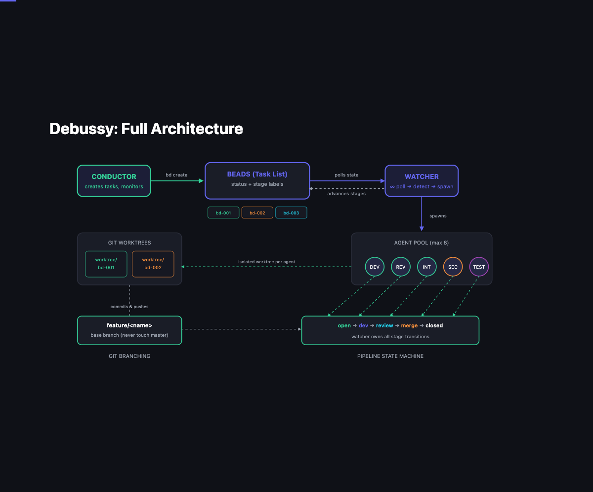
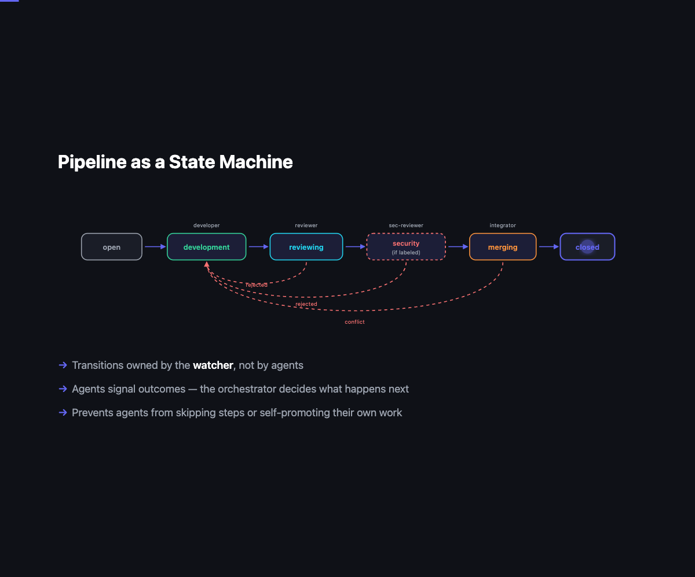
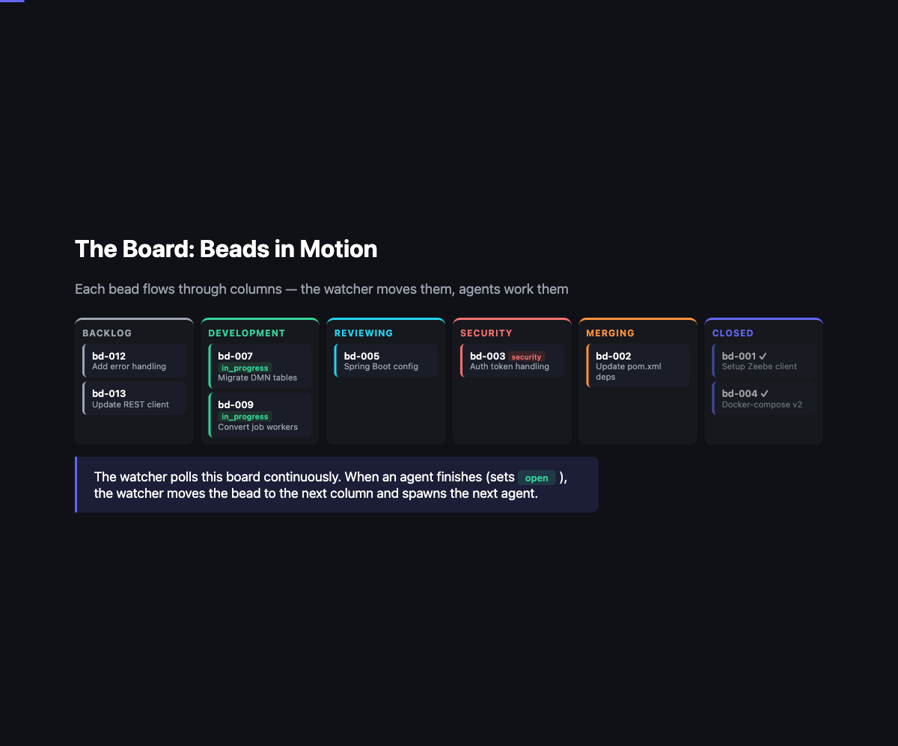

# Debussy

**Multi-agent orchestration for Claude Code.**

*Named after Claude Debussy, the impressionist composer. Agents are named after composers too (e.g., `developer-beethoven`, `reviewer-chopin`).*



---

## Quick Start

```bash
# Install
brew install tmux beads
pipx install git+https://github.com/tsturo/debussy.git

# Run
cd your-project
dbs start
```

**Prerequisites:** Your project must be a git repository with an `origin` remote configured.

---

## Architecture

Debussy has three layers:

1. **Conductor** - the entry point. You talk to it, it plans work and creates tasks (beads). It never writes code.
2. **Watcher** - the orchestration engine. Polls beads every 5 seconds, spawns Claude agents based on stage labels, owns all stage transitions.
3. **Agents** - specialized Claude instances (developer, reviewer, security-reviewer, integrator, tester, investigator) that do the actual work in isolated git worktrees.

```
You ↔ Conductor (plans, creates tasks)
              ↓
         Watcher (polls every 5s, spawns agents, manages transitions)
              ↓
     Agents (work in isolated worktrees, signal results via status)
```

---

## Pipelines

### Development Pipeline

Each bead flows through four stages. The watcher advances beads automatically based on agent signals.



```
open → stage:development → stage:reviewing → stage:merging → closed
              ↓                  ↓                ↓
          developer           reviewer        integrator
              ↑                  │                │
              └──────────────────┴────────────────┘  (on rejection → back to development)
```

Beads with the `security` label get an extra stage after code review:

```
stage:reviewing → stage:security-review → stage:merging
                        ↓
                  security-reviewer
```

After all beads in a batch are merged, a batch acceptance bead runs:

```
stage:acceptance → closed
       ↓
     tester
```

### Investigation Pipeline

Parallel research with consolidation:

```
stage:investigating (parallel) → stage:consolidating → .md file → conductor creates dev tasks
          ↓                              ↓
     investigator                   investigator
```

Investigators research in parallel and document findings as comments. A consolidation bead (blocked by investigation beads) waits for all to finish, then synthesizes findings into an `.md` file.

---

## Watcher Orchestration

The watcher is the central state machine. It runs a loop every 5 seconds:

1. **Check timeouts** - kill agents running longer than `agent_timeout` (default 1 hour)
2. **Clean up finished agents** - detect completed agents and process their results
3. **Reset orphaned beads** - if an agent disappeared but bead is still `in_progress`, reset it
4. **Resolve dependencies** - unblock beads whose dependencies have all closed
5. **Spawn new agents** - for beads with `status: open` + a stage label, up to `max_total_agents`

### Status Model

| bd status | Meaning |
|-----------|---------|
| `open` + stage label | Ready for agent |
| `open` (no stage label) | Backlog/parked |
| `in_progress` | Agent is working |
| `closed` | Pipeline complete |
| `blocked` | Waiting for deps / needs conductor |

### Stage Transition Ownership

**The watcher owns ALL stage transitions.** Agents never add or remove stage labels. Agents only set bead status to signal their result:

| Agent Signal | Command | When |
|--------------|---------|------|
| Claim | `--status in_progress` | Starting work |
| Success | `--status open` | Work complete |
| Done | `--status closed` | Terminal stage (merge, acceptance, investigation) |
| Rejected | `--status open --add-label rejected` | Failed review/test |
| Blocked | `--status blocked` | Can't proceed |

The watcher reads the bead state after the agent finishes and transitions accordingly:

| Bead State After Agent | Watcher Action |
|------------------------|----------------|
| `open`, no `rejected` | Remove current stage, add next stage |
| `open` + `rejected` | Remove stage + rejected, add `stage:development` (retry) |
| `closed` | Remove stage label (done) |
| `blocked` | Remove stage label (parked for conductor) |

### Resilience

- **Rejection cooldown**: 60 seconds before retrying a rejected bead
- **Max rejections**: After 5 rejections, bead is blocked and needs conductor intervention
- **Empty branch detection**: If a developer doesn't commit anything, retries up to 3 times
- **Crash recovery**: If an agent crashes within 30 seconds, counts as a failure. After 3 consecutive failures, bead is parked
- **Orphan recovery**: Beads stuck as `in_progress` with no running agent are reset to `open`
- **Integrator queueing**: Only one integrator runs at a time to avoid merge conflicts
- **Priority sorting**: Bugs are prioritized over features

### Event Recording

All pipeline events (spawn, advance, reject, close, block, timeout, crash) are recorded to `.debussy/pipeline_events.jsonl`. Use `dbs metrics` to view analytics.

---

## Git Worktree Isolation

Each agent works in an isolated git worktree under `.debussy-worktrees/`:

| Role | Worktree Branch |
|------|-----------------|
| Developer | New branch `feature/{bead_id}` from `origin/{base}` |
| Reviewer | Detached at `origin/feature/{bead_id}` (read-only) |
| Security-reviewer | Detached at `origin/feature/{bead_id}` (read-only) |
| Integrator | Detached at `origin/{base}` (merge target) |
| Tester | Detached at `origin/{base}` |
| Investigator | No worktree (works in main repo) |

Worktrees symlink `.beads/` and `.debussy/` back to the main repo so all agents share the same task database and configuration.

---

## Branching Model

```
master (manual merge only by user)
  └── feature/<name>          ← conductor's base branch
        ├── feature/bd-001    ← developer branch (merged back by integrator)
        ├── feature/bd-002
        └── feature/bd-003
```

Agents never merge to master.

---

## Agents


| Agent | Role | Terminal? |
|-------|------|-----------|
| **conductor** | Creates tasks, monitors progress, never writes code | N/A |
| **developer** | Implements features and fixes on feature branch | No |
| **reviewer** | Reviews code quality, runs tests | No |
| **security-reviewer** | OWASP-aligned security review for beads with `security` label | No |
| **integrator** | Merges feature branch to conductor's base branch | Yes |
| **tester** | Batch acceptance testing after all beads merged | Yes |
| **investigator** | Researches codebase, documents findings. Also handles consolidation | Yes |

---

## Kanban Board



---

## Commands

```bash
dbs start [requirement]  # Start tmux session with optional initial requirement
dbs watch                # Run watcher only
dbs status               # Show active agents, branches, base branch
dbs board                # Kanban board view
dbs metrics              # Pipeline analytics (stage durations, rejections)
dbs config [key] [value] # View/set config
dbs backup               # Backup beads database
dbs clear [-f]           # Clear all beads (with backup)
dbs upgrade              # Upgrade to latest version
dbs restart [-u]         # Restart session (-u to upgrade first)
dbs pause                # Stop watcher, kill agents, reset beads to open
dbs debug                # Troubleshoot pipeline detection
```

---

## Configuration

```bash
dbs config                          # Show all
dbs config max_total_agents 8       # Max concurrent agents (default: 8)
dbs config use_tmux_windows true    # Spawn agents as tmux windows (default: false)
dbs config base_branch feature/foo  # Conductor's base branch
dbs config agent_timeout 3600       # Agent timeout in seconds (default: 3600)
```

### tmux Windows Mode

When `use_tmux_windows` is enabled, agents spawn as separate tmux windows instead of background processes:

- Real-time output visible (no log buffering)
- Switch between agents with `Ctrl-b n/p` or `Ctrl-b w`
- Window closes when agent finishes

---

## Creating Tasks

### Development Tasks
```bash
bd create "Implement feature X" -d "Description of what to do"
bd update <bead-id> --add-label stage:development
```

### Parallel Investigation
```bash
bd create "Investigate area A" -d "Research details"                             # → bd-001
bd create "Investigate area B" -d "Research details"                             # → bd-002
bd create "Consolidate findings" -d "Synthesize results" --deps "bd-001,bd-002"  # → bd-003
bd update bd-001 --add-label stage:investigating
bd update bd-002 --add-label stage:investigating
bd update bd-003 --add-label stage:consolidating
```

### Batch Acceptance
```bash
bd create "Acceptance testing" -d "Run full test suite" --deps "bd-001,bd-002,bd-003"
bd update <id> --add-label stage:acceptance
```
The acceptance bead stays blocked until all dependencies close.

---

## tmux Layout

```
┌──────────┬──────────┬─────────┐
│conductor │          │         │
├──────────┤  board   │ watcher │
│   cmd    │          │         │
└──────────┴──────────┴─────────┘
```

- **conductor**: Main Claude instance for task creation
- **cmd**: Shell for manual commands
- **board**: Auto-refreshing kanban board (updates every 5s)
- **watcher**: Agent spawner logs

---

## Setup for Existing Project

```bash
cd your-project
bd init
dbs start
```

---

## Project Structure

```
src/debussy/
  cli.py              # CLI command handlers (thin dispatch layer)
  watcher.py          # Watcher run loop and agent state management
  config.py           # Configuration, constants, stage/status definitions
  bead_client.py      # Shared bead query/mutation functions (wraps bd CLI)
  transitions.py      # Stage transition logic (state machine)
  spawner.py          # Agent spawning (tmux windows and background processes)
  pipeline_checker.py # Pipeline scanning and dependency resolution
  board.py            # Kanban board rendering
  metrics.py          # Pipeline analytics and stage duration tracking
  status.py           # Status and debug display
  tmux.py             # Tmux session and window management
  worktree.py         # Git worktree lifecycle
  prompts/            # Agent prompt templates (one file per role)
tests/
  test_bead_client.py # Tests for bead data access layer
  test_transitions.py # Tests for stage transition logic
```

---

## License

MIT
