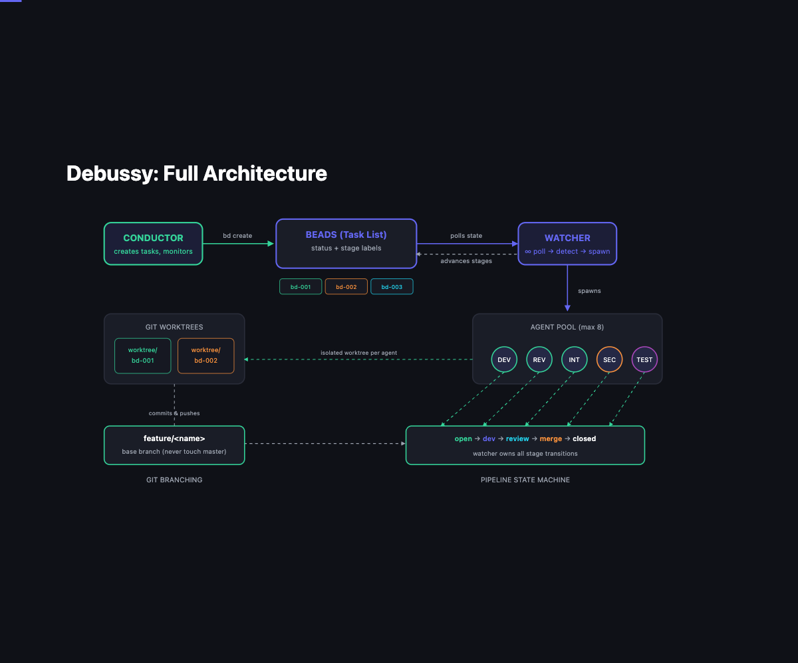
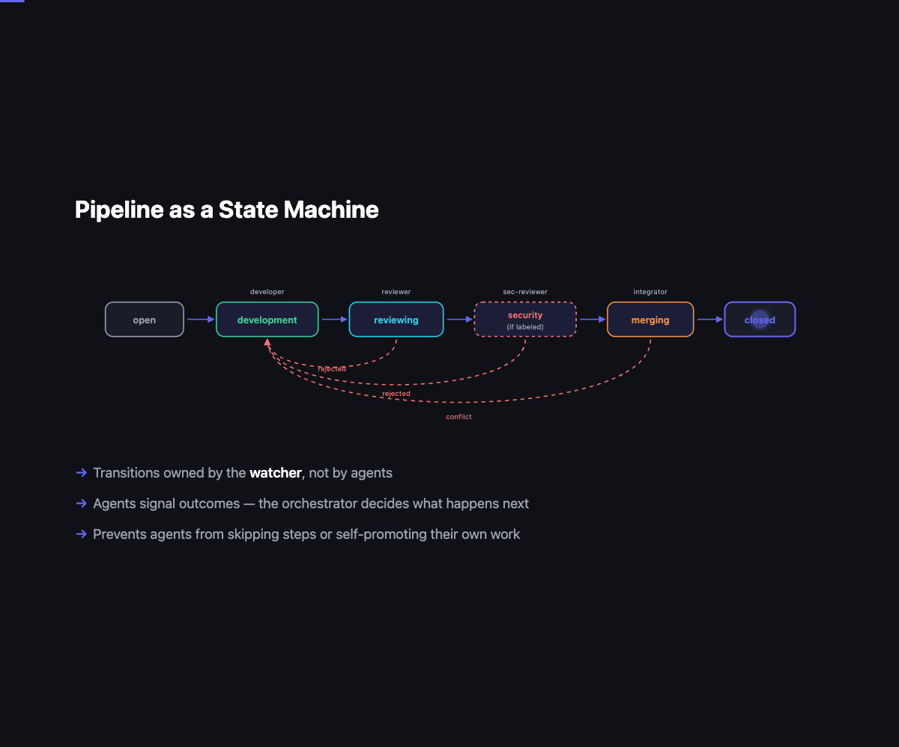
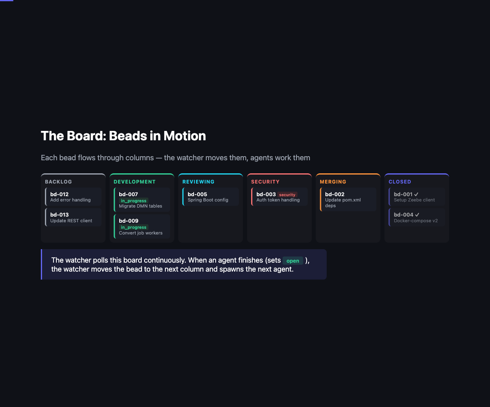

# Debussy

**Multi-agent orchestration for Claude Code.**

*Named after Claude Debussy, the impressionist composer. Agents are named after composers too (e.g., `developer-beethoven`, `reviewer-chopin`).*



---

## Prerequisites

- **Python 3.10+**
- **tmux** — agents run in tmux panes/windows
- **Claude Code** (`claude` CLI) — agents are Claude Code instances
- **pipx** — for isolated CLI installation
- **git** — your project must be a git repository with an `origin` remote

## Installation

```bash
brew install tmux
pipx install git+https://github.com/tsturo/debussy.git
```

To upgrade later:

```bash
debussy upgrade
```

## Quick Start

```bash
cd your-project
debussy start
```

This opens a tmux session with four panes: conductor, board, watcher, and a shell. Talk to the conductor to plan work — it creates tasks, and the watcher automatically spawns agents to execute them.

### First Run Checklist

1. Verify your project has an `origin` remote: `git remote -v`
2. Run `debussy start` — this creates `.debussy/` and `.takt/` directories (auto-added to `.gitignore`)
3. The conductor will ask what you want to build, then create tasks and a feature branch
4. The watcher picks up tasks and spawns developer/reviewer/integrator agents automatically
5. When all tasks are done, merge the feature branch to master yourself (agents never touch master)

---

## Architecture

Debussy has three layers:

1. **Conductor** - the entry point. You talk to it, it plans work and creates tasks. It never writes code.
2. **Watcher** - the orchestration engine. Polls tasks every 5 seconds, spawns Claude agents based on stage, owns all stage transitions.
3. **Agents** - specialized Claude instances (developer, reviewer, security-reviewer, integrator, tester) that do the actual work in isolated git worktrees.

### Task Tracking (takt)

Debussy includes **takt**, a built-in SQLite task tracker. No external dependencies — tasks are stored in `.takt/` as a local SQLite database.

---

## Pipelines

### Development Pipeline

Each task flows through stages. The watcher advances tasks automatically based on agent signals. Tasks with the `security` tag get an extra security review stage. After all tasks in a batch are merged, a batch acceptance task runs.

```
Per task:      backlog → development → reviewing → merging → done
Security task: backlog → development → reviewing → security_review → merging → done
Per batch:     acceptance task (deps on all tasks) → acceptance → done
```



## Watcher Orchestration

The watcher is the central state machine. It runs a loop every 5 seconds:

1. **Check timeouts** - kill agents running longer than `agent_timeout` (default 1 hour)
2. **Clean up finished agents** - detect completed agents and process their results
3. **Reset orphaned tasks** - if an agent disappeared but task is still `active`, reset it
4. **Resolve dependencies** - unblock tasks whose dependencies are all done
5. **Spawn new agents** - for tasks with `status: pending` in an actionable stage, up to `max_total_agents`

### State Model

Two-field state model (stage + status):

| Stage | Status | Meaning |
|-------|--------|---------|
| `development` | `pending` | Ready for developer agent |
| `development` | `active` | Developer is working |
| `reviewing` | `pending` | Ready for reviewer agent |
| `merging` | `pending` | Ready for integrator agent |
| `acceptance` | `pending` | Ready for tester agent |
| `backlog` | `pending` | Backlog/parked |
| any | `blocked` | Waiting for deps / needs conductor |
| `done` | `pending` | Pipeline complete |

### Stage Transition Ownership

**The watcher owns ALL stage transitions.** Agents never call `takt advance` or `takt reject`. Agents only set status to signal their result:

| Agent Signal | Command | When |
|--------------|---------|------|
| Claim | `takt claim <id>` | Starting work |
| Success | `takt release <id>` | Work complete |
| Rejected | `takt release <id>` + `takt comment <id> "rejected: reason"` | Failed review/test |
| Blocked | `takt block <id>` | Can't proceed |

The watcher reads the task state after the agent finishes and transitions accordingly:

| Task State After Agent | Watcher Action |
|------------------------|----------------|
| `pending`, no rejection | `takt advance` → next stage |
| `pending`, rejected | `takt reject` → back to development |
| `pending`, rejected (acceptance) | Block for conductor |
| terminal stage complete | Advance to done |
| `blocked` | Parks for conductor |

### Resilience

- **Rejection cooldown**: 60 seconds before retrying a rejected task
- **Max rejections**: After 5 rejections, task is blocked and needs conductor intervention
- **Empty branch detection**: If a developer doesn't commit anything, retries up to 3 times
- **Crash recovery**: If an agent crashes within 30 seconds, counts as a failure. After 3 consecutive failures, task is parked
- **Orphan recovery**: Tasks stuck as `active` with no running agent are reset to `pending`
- **Integrator queueing**: Only one integrator runs at a time to avoid merge conflicts
- **Priority sorting**: Bugs are prioritized over features

### Event Recording

All pipeline events (spawn, advance, reject, close, block, timeout, crash) are recorded to `.debussy/pipeline_events.jsonl`. Use `debussy metrics` to view analytics.

---

## Git Worktree Isolation

Each agent works in an isolated git worktree under `.debussy-worktrees/`:

| Role | Worktree Branch |
|------|-----------------|
| Developer | New branch `feature/{task_id}` from `origin/{base}` |
| Reviewer | Detached at `origin/feature/{task_id}` (read-only) |
| Security-reviewer | Detached at `origin/feature/{task_id}` (read-only) |
| Integrator | Detached at `origin/{base}` (merge target) |
| Tester | Detached at `origin/{base}` |

Worktrees symlink `.takt/` and `.debussy/` back to the main repo so all agents share the same task database and configuration.

---

## Branching Model

```
master (manual merge only by user)
  └── feature/<name>             ← conductor's base branch
        ├── feature/PRJ-1  ← developer branch (merged back by integrator)
        ├── feature/PRJ-2
        └── feature/PRJ-3
```

Agents never merge to master.

---

## Agents

| Agent | Role | Terminal? |
|-------|------|-----------|
| **conductor** | Creates tasks, monitors progress, never writes code | N/A |
| **developer** | Implements features and fixes on feature branch | No |
| **reviewer** | Reviews code quality, runs tests | No |
| **security-reviewer** | OWASP-aligned security review for tasks with `security` tag | No |
| **integrator** | Merges feature branch to conductor's base branch | Yes |
| **tester** | Batch acceptance testing after all tasks merged | Yes |

---

## Kanban Board



---

## Commands

### Debussy

```bash
debussy start [requirement]  # Start tmux session with optional initial requirement
debussy watch                # Run watcher only
debussy status               # Show active agents, branches, base branch
debussy board                # Kanban board view
debussy metrics              # Pipeline analytics (stage durations, rejections)
debussy config [key] [value] # View/set config
debussy backup               # Backup takt database
debussy clear [-f]           # Clear all tasks (with backup)
debussy upgrade              # Upgrade to latest version
debussy restart [-u]         # Restart session (-u to upgrade first)
debussy pause                # Stop watcher, kill agents, reset tasks to pending
debussy debug                # Troubleshoot pipeline detection
```

### Takt (task tracking)

```bash
takt prefix [VALUE]                    # Show or set project prefix (e.g. PKL)
takt create "title" -d "description"   # Create task (returns PRJ-N ID)
takt advance <id>                      # Move task to next stage
takt show <id>                         # Show task details
takt list                              # List all tasks
takt claim <id>                        # Mark task as active
takt release <id>                      # Mark task as pending
takt block <id>                        # Mark task as blocked
takt reject <id>                       # Send task back to development
takt comment <id> "message"            # Add comment to task
takt log <id>                          # View task history
takt project add <PREFIX> <NAME>       # Add a project
takt project list                      # List projects
takt project default [PREFIX]          # Show or switch default project
takt project rm <PREFIX>               # Remove a project
```

---

## Task Workflow

### Creating Tasks

```bash
takt create "Implement feature X" -d "Description of what to do"
takt advance <task-id>    # moves backlog → development
```

### Batch Acceptance

```bash
takt create "Acceptance testing" -d "Run full test suite" --deps "PRJ-1,PRJ-2"
takt advance <id>
```
The acceptance task stays blocked until all dependencies are done.

---

## tmux Layout

```
┌──────────┬──────────┬─────────┐
│conductor │          │         │
├──────────┤  board   │ watcher │
│   cmd    │          │         │
└──────────┴──────────┴─────────┘
```

- **conductor**: Main Claude instance for task creation
- **cmd**: Shell for manual commands
- **board**: Auto-refreshing kanban board (updates every 5s)
- **watcher**: Agent spawner logs

---

## Project Structure

```
src/debussy/
  cli.py              # CLI command handlers (thin dispatch layer)
  watcher.py          # Watcher run loop and agent state management
  config.py           # Configuration, constants, stage/status definitions
  transitions.py      # Stage transition logic (state machine)
  spawner.py          # Agent spawning (tmux windows and background processes)
  pipeline_checker.py # Pipeline scanning and dependency resolution
  board.py            # Kanban board rendering
  metrics.py          # Pipeline analytics and stage duration tracking
  status.py           # Status and debug display
  tmux.py             # Tmux session and window management
  worktree.py         # Git worktree lifecycle
  diagnostics.py      # Failure diagnostics for agent deaths
  preflight.py        # Pre-spawn validation checks
  prompts/            # Agent prompt templates (one file per role)
  takt/               # Built-in SQLite task tracking
    db.py             # Database connection and schema
    models.py         # Task CRUD operations
    log.py            # Log entries and workflow operations
    cli.py            # CLI entry point for takt command
tests/
  test_takt_db.py     # Tests for takt database layer
  test_takt_models.py # Tests for takt task model
  test_takt_log.py    # Tests for takt log and workflow operations
  test_takt_cli.py    # Tests for takt CLI
  test_takt.py        # End-to-end takt tests
  test_transitions.py # Tests for stage transition logic
  test_spawner.py     # Tests for agent spawning
  test_pipeline_checker.py # Tests for pipeline scanning
.takt/                # SQLite task database (auto-created)
```

---

## Configuration Reference

Settings are stored in `.debussy/config.json`. Defaults:

| Key | Default | Description |
|-----|---------|-------------|
| `max_total_agents` | 8 | Max concurrent agents across all roles |
| `use_tmux_windows` | false | Spawn agents as tmux windows instead of background processes |
| `agent_timeout` | 3600 | Kill agents after this many seconds |
| `base_branch` | — | Conductor's feature branch (set per feature) |
| `role_models` | see below | Claude model per agent role |

Default model assignments:

| Role | Model |
|------|-------|
| conductor | claude-opus-4-6[1m] |
| developer | claude-sonnet-4-6 |
| reviewer | claude-opus-4-6 |
| security-reviewer | claude-opus-4-6 |
| integrator | claude-sonnet-4-6 |
| tester | claude-sonnet-4-6 |

Override any role's model:

```bash
debussy config role_models '{"developer": "claude-opus-4-6"}'
```

### tmux Windows Mode

When `use_tmux_windows` is enabled, agents spawn as separate tmux windows instead of background processes:

- Real-time output visible (no log buffering)
- Switch between agents with `Ctrl-b n/p` or `Ctrl-b w`
- Window closes when agent finishes

---

## License

MIT
